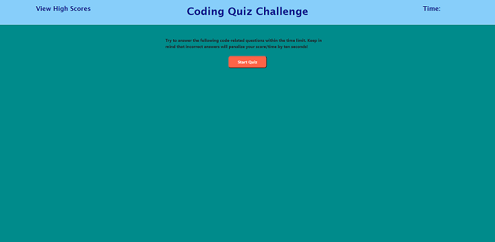

# code-quiz

## Description

In this project, I created a Web page that allows a user to take a timed coding quiz with multiple-choice questions. After answering four questions, the player is given the option of saving their initials along with their score. The player will then be presented with a list of high scores and initials. The app will run in the browser and will feature dynamically updated HTML and CSS powered by JavaScript code.

## Functionality

* After clicking a start button a timer starts and the user is presented with a question and four answers.
* The user will select an answer by clicking on it.
* When an answer is clicked the next question and answers set will display with a message telling the user whether their previous answer was correct or wrong.
* After the final question is answered or the timer runs out the user will be presented with their final score and an input box to enter their intials and save their score.
* The final page will display a list in descending order of scores and initials.
* There will also be two buttons on the high score list page, one for clearing all the scores and one for returning to the main quiz page.

## Installation

This project requires the following files and folders:

* index.html
* assests/js/script.js
* assets/css/style.css

## Deployed Website

[Code Quiz Website](https://johannaleal.github.io/code-quiz/)

## Repository

[Repository](https://github.com/johannaleal/code-quiz)

## Index.html Screenshot

## Question and Answers Page

## Wrong Answer

## All Done Page

## High Scores Page

