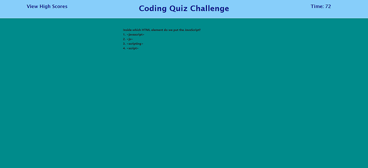

# code-quiz

## Description

In this project, I created a JavaScript quiz Web page that allows a user to answer four different
code-related questions. After answering four questions, the player is given the option of saving their initials along with their score. The player will then be presented with a list of high scores and initials.

## Installation

This project requires the following files and folders:

* index.html
* assests/js/script.js
* assets/css/style.css

## Deployed Website

[Code Quiz Website](https://johannaleal.github.io/code-quiz/)

## Repository

[Repository](https://github.com/johannaleal/code-quiz)

## Index.html Screenshot

## Question and Answers Page

## Wrong Answer

## All Done Page

